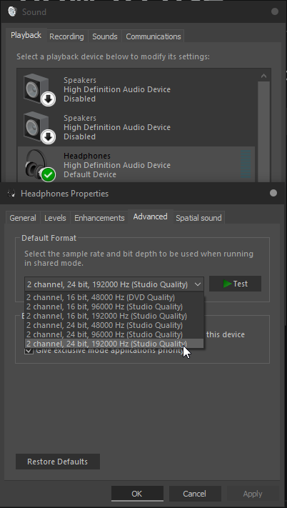

# demo

# what code does

1. listen to some audio endpoints (speaker/headphone/mic) with WASAPI

2. create a overlay window

3. draw some `frequency`->`amplitude` graphs based on what code hears in audio endpoints(x-axis = `frequency`, y-axis = `amplitude`)

    frequency is log-spaced, meaning distance between any piano key to its next is always same

    graph type includes:

    - `complex`: `real/imag`
    - `abs`: `hypot(real, imag)`
    - `harmonic_product`: `A(f) × A(2f) × ... × A(Nf)`
    - `harmonic_product_skip_f0`: `A(2f) × ... × A(Nf)`

4. for each graph, draw `note name` of top `n` local maximum, so you can see which notes are played (`n` is configurable in config file, default value is `4`)

5. monitor and hot-reload config file

# credit

1. https://github.com/fastfloat/fast_float

2. https://github.com/jk-jeon/dragonbox

3. https://github.com/ifduyue/musl/tree/master/src/math

4. https://github.com/shibatch/sleef/blob/7df8e36/src/libm/sleefsp.c

5. https://github.com/shibatch/sleef/blob/7df8e36/src/libm/sleefdp.c

6. https://github.com/Quuxplusone/Xoshiro256ss

7. https://github.com/Tencent/ncnn/blob/master/src/layer/x86/sse_mathfun.h

8. https://github.com/Tencent/ncnn/blob/master/src/layer/x86/avx_mathfun.h

9. https://github.com/Tencent/ncnn/blob/master/src/layer/x86/avx512_mathfun.h

10. https://github.com/RJVB/MacSTL/blob/master/test/sse_mathfun.h

11. https://github.com/facebook/folly/blob/main/folly/Traits.h

12. https://github.com/swansontec/map-macro

13. https://www.scs.stanford.edu/~dm/blog/va-opt.html

14. https://github.com/ww898/utf-cpp

15. https://github.com/lucasg/Dependencies/blob/master/ClrPhlib/src/managed/Phlib.cpp

16. https://github.com/JustasMasiulis/inline_syscall

17. https://github.com/skelsec/SMBtest/blob/master/NTStatus.py

18. https://github.com/wine-mirror/wine/blob/master/include/ntstatus.h

19. https://github.com/paskalian/WID_LoadLibrary

20. https://www.foonathan.net/2020/09/move-forward

21. https://stackoverflow.com/a/62984543

22. https://github.com/winsiderss/phnt

# how to compile

you only have to compile code with 1 compiler, not all 3. my favorite is clang-cl

#### msvc:

1. download and install latest [visual studio preview community](https://visualstudio.microsoft.com/insiders/), install desktop c++

2. open `audio_spectrum.vcxproj`

3. select release, then build

    `audio_spectrum.vcxproj` uses `/arch:AVX512`, program will crash if your cpu does not run `avx512` code, in which case you need to change `/arch:AVX512` to something else

#### clang-cl:

1. download and install latest [visual studio preview community](https://visualstudio.microsoft.com/insiders/), install desktop c++

2. install latest [llvm](https://github.com/llvm/llvm-project/releases/)

3. run `build-llvm-release64.bat`

    `build-llvm-release64.bat` uses `-march=native`, meaning compiled `.exe` will be optimized for whatever cpu its compiled on, and it might crash when running on different cpu

#### g++:

1. build g++ from https://github.com/gcc-mirror/gcc (task is left as a exercise for reader)

2. run `build-gcc-release64.bat`

    `build-gcc-release64.bat` uses `-march=native`, meaning compiled `.exe` will be optimized for whatever cpu its compiled on, and it might crash when running on different cpu

# how to use

1. install x64 cpu, preferably with avx512

2. install windows10/windows11

3. install at least 1 audio endpoint (such as headphone, speaker, mic)

4. compile code into `.exe`(see `how to compile` section)

5. set default audio output device frequency to maximum

6. run .exe (make sure program have read/write access to config file, default path is `c:\audio spectrum cfg.txt`)

7. edit config file and see changes right away

# config file

todo